# Technical Design Document

**NuAuth / MidnightZK Data Marketplace for Authentic Human Data**

This document is the **single repo-aligned technical design**: architecture, data flows, on-chain / ZK interfaces, and integration runbooks.

## 1. Scope

### 1.1 What this repo implements

This repository is a **backend + contract prototype** of a human intelligence data marketplace:

- **Cardano (L1)** for public anchoring and licensing payments
  - Stamping uses **CIP-20** metadata (label `674`)
  - Licensing uses a **Plutus V3 listing validator** (`nuauth_license_listing`) that supports *lock listing* and *purchase*
  - Integration is via **Lucid Evolution** (Blockfrost Preprod or in-process emulator)
- **Midnight (ZK / private ledger)** for **ZK content stamping**
  - Compact contract `nuauth-stamp` with circuits: `proveCreatorStamp`, `bindL1Stamp`
  - Deployed/exercised via `midnight-local-cli` (targets: `undeployed` local Docker, or `preview` / `preprod`)
- **Off-chain API (Deno / Hono)** orchestrating flows and enforcing policy
  - Local **encrypted IP repository** (`data/blobs/`) + JSON registry (`data/registry.json`)
  - "ABE module" is a **prototype**: policy-bound key derivation + AES-GCM (documented as a replaceable CP-ABE stand-in)
  - **Marketplace integration** occurs through REST endpoints: register, stamp, midnight attest, list, license, decrypt

### 1.2 Design principle

**ZK content stamping is satisfied on Midnight, not on Cardano alone.**

A dataset is considered **ZK-complete** only when:

1) the dataset is stamped on **Cardano** (metadata tx exists), and  
2) the **Midnight** circuits have been executed and **attested** to the API via `POST /api/creator/midnight/attest`.

With `NUAUTH_REQUIRE_MIDNIGHT_STRICT` enabled (default), **list-license / license / decrypt** are gated on `zkComplete`.

### 1.3 Non-goals

- No UI/frontend deliverable (demos are scripts + logs + testnet tx hashes)
- No decentralized blob network yet (IP repo is local disk; interface is shaped so a decentralized backend can replace it)
- No real pairing-based CP-ABE yet (the prototype enforces the *shape* of policy-gated decrypt; cryptography is explicitly replaceable)

## 2. System architecture

### 2.1 Component diagram

Horizontal layout keeps **actors**, **off-chain services**, **Cardano**, and **Midnight** visually separated. Solid lines are primary control/data paths; dashed lines are *binding inputs* (env / digests), not extra HTTP calls from the CLI to the API.

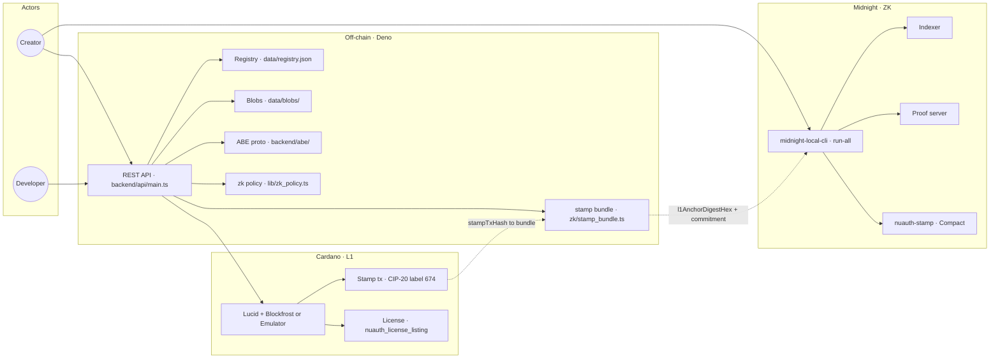

### 2.2 Trust boundaries

- **Cardano:** public ledger. Stores anchors and licensing transactions. Never stores raw dataset content.
- **Midnight:** private ledger + ZK execution venue. Proves creator authority and binds the L1 anchor digest in private state.
- **API:** stores encrypted blobs and a registry; enforces marketplace policy (license + zkComplete gating).
- **Wallet secrets:** mnemonics/keys live in environment variables for prototypes; must never be committed.

## 3. ZK content stamping protocol

### 3.1 Data objects

- **Dataset**: identified by `datasetId` (UUID in registry)
- **Content commitment**: `contentCommitmentHex` = SHA-256(plaintext bytes) (computed at `POST /api/creator/register`)
- **Cardano stamp tx**: CIP-20 metadata includes dataset identifiers and stamping payload
- **L1 anchor digest**: `l1AnchorDigestHex` computed from Cardano stamp tx hash (derived by backend and returned by `POST /api/creator/stamp`)
- **Midnight contract state**: stores the commitment and (after binding) the L1 anchor digest

### 3.2 Protocol steps

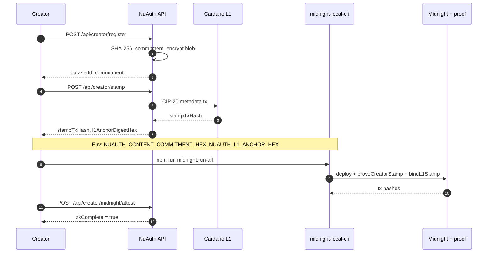

### 3.3 Midnight Compact contract and circuits

Source: `contract/src/nuauth-stamp.compact`.

#### 3.3.1 Ledger state

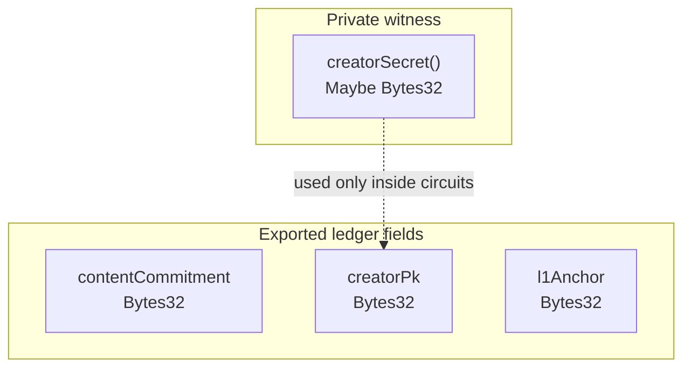

#### 3.3.2 Constructor to circuits

`run-all` deploys then runs the two circuits in sequence. This diagram matches the on-disk contract logic.

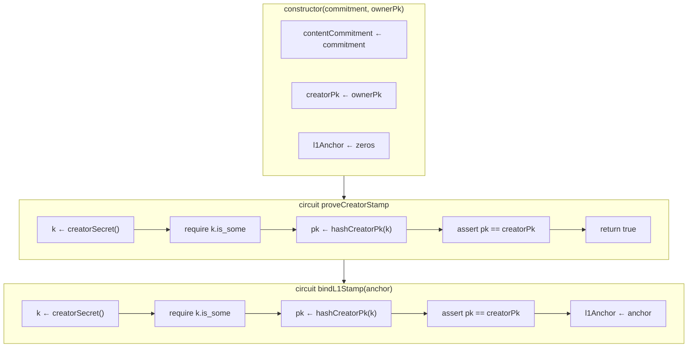

#### 3.3.3 Creator public key derivation

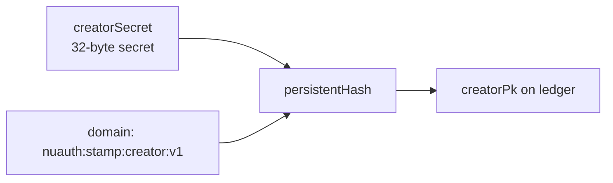

#### 3.3.4 Binding digest from Cardano to Midnight

Backend `backend/zk/stamp_bundle.ts` derives `l1AnchorDigestHex` from the **Cardano** stamp transaction id; that 32-byte value is passed as `anchor` into `bindL1Stamp` (env `NUAUTH_L1_ANCHOR_HEX` in the CLI).

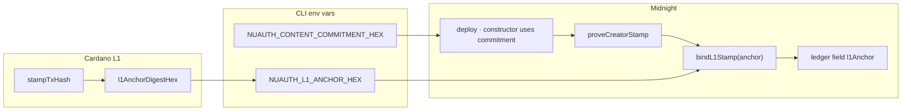

**Commitment** is supplied at **deploy** (`NUAUTH_CONTENT_COMMITMENT_HEX`). **Anchor** is supplied to **`bindL1Stamp`** (`NUAUTH_L1_ANCHOR_HEX`), derived from the Cardano stamp tx via `stamp_bundle.ts`.

- **`proveCreatorStamp`**: proves knowledge of `creatorSecret` such that `hashCreatorPk(secret) == creatorPk` (creator authority).
- **`bindL1Stamp`**: same proof gate, then **`l1Anchor := anchor`** (Midnight and Cardano binding).

**Why two steps?** Separates who is the creator from which L1 stamp event is bound, and matches API attestation (`proveCreatorStampTxHash` vs `bindL1StampTxHash`).

### 3.4 ZK-complete policy

Backend policy (see `backend/lib/zk_policy.ts`) treats a dataset as `zkComplete` when:

- Cardano stamp metadata exists in registry, and
- Midnight attestation exists (`contractAddress`, `proveCreatorStampTxHash`, `bindL1StampTxHash`)

Strict mode:

- `NUAUTH_REQUIRE_MIDNIGHT_STRICT` default: **on**
- When on, **list-license / license / decrypt** require `zkComplete=true`

## 4. Licensing smart contracts on Cardano

### 4.1 Contract shape

Licensing is implemented as a **listing + purchase** flow using a Plutus V3 validator (`nuauth_license_listing`):

- **List (lock)**: creator locks a UTxO at the script address with an inline datum including `datasetId`, seller identity, and `priceLovelace`
- **Purchase (spend)**: buyer spends the listing UTxO with a redeemer indicating purchase and pays the seller

The backend records a license row as `kind: "plutus_v3_listing"` and uses that row (plus buyer address) to gate decrypt.

### 4.1.1 Cardano: two L1 mechanisms

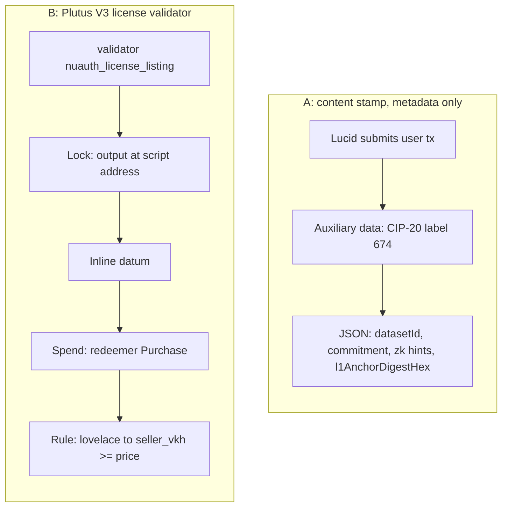

### 4.1.2 Aiken types and on-chain rule

From `cardano/aiken/validators/nuauth_license_listing.ak`:

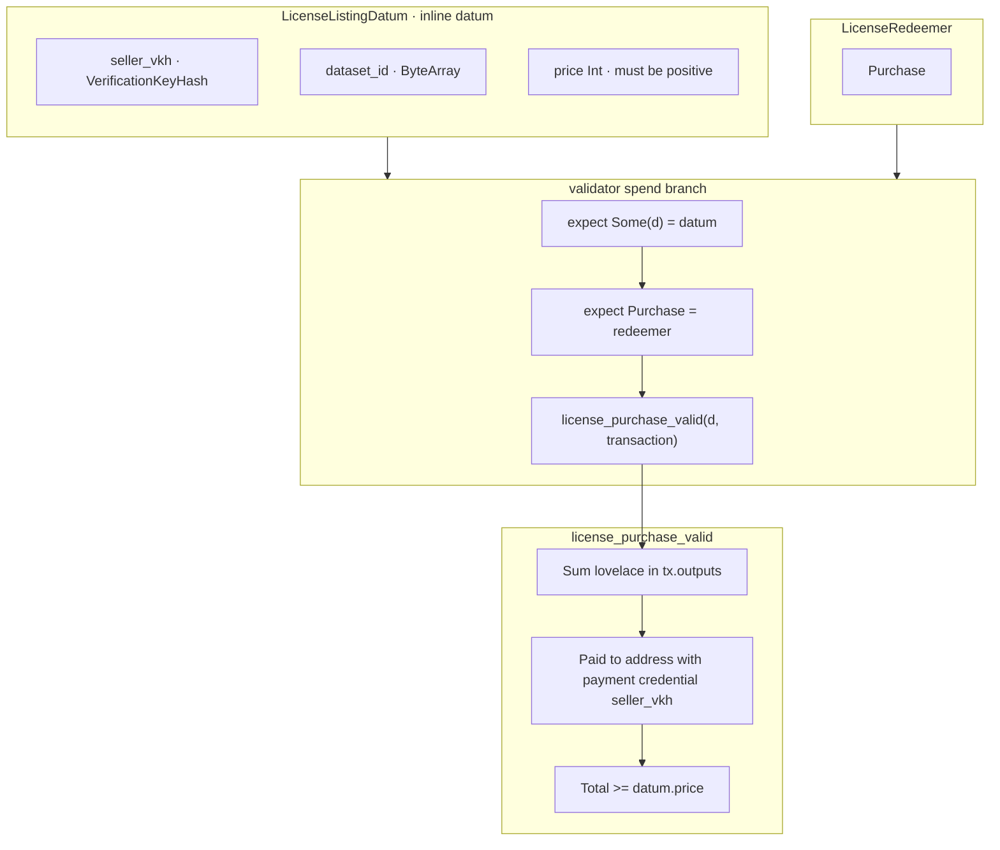

### 4.1.3 Listing UTxO lifecycle

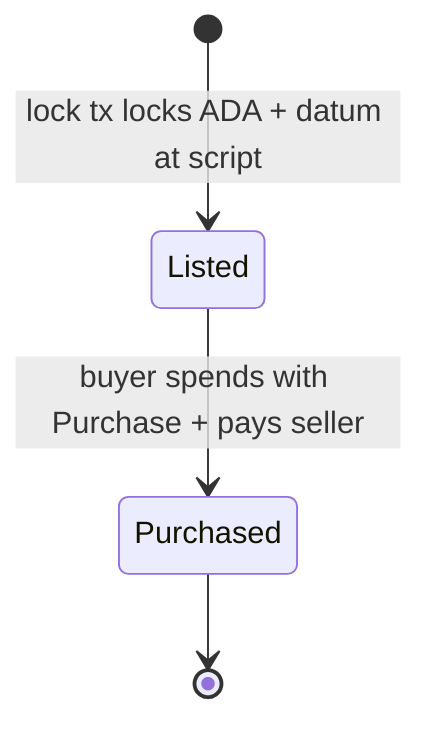

### 4.2 Licensing data flow

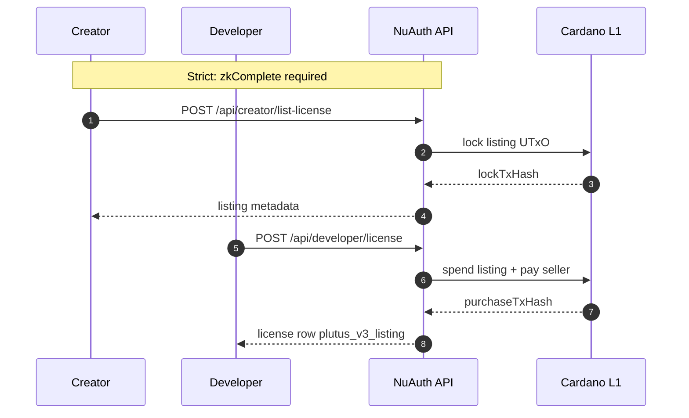

### 4.3 Interface contracts

This repo’s backend constructs datum/redeemer values (see `backend/licensing/` and `backend/cardano/license_listing.ts`) and loads the compiled validator from `cardano/aiken/plutus.json`.

**Design constraint:** validators must be reproducibly buildable (Aiken build outputs are used by backend).

### 4.4 Future extensions

- Royalties / revenue splits
- Expiring licenses (time bounds)
- Multiple license tiers per dataset (price discrimination)
- NFT-style license tokens (optional)

## 5. Decentralized IP repository

### 5.1 Current module behavior

The IP repository is presently a local encrypted blob store with a registry index:

- Ciphertexts: `data/blobs/{datasetId}.bin`
- Index/metadata: `data/registry.json`

The API never stores plaintext; it stores:

- `datasetId`, filename, commitment
- storage handle / blob path
- stamp tx hashes
- midnight attestation
- licenses purchased (buyer address + tx hash)

### 5.2 Target interface for decentralization

To swap local disk for a decentralized backend (IPFS / Arweave / Filecoin / S3 + content addressing), preserve these interface responsibilities:

- `put(ciphertext, metadata) -> handle`
- `get(handle) -> ciphertext`
- `list/filter by datasetId`

The registry remains the canonical market state unless replaced with a more durable index (DB or on-chain registry).

## 6. Attribute-Based Encryption module

### 6.1 What ABE means in this repo

This prototype uses **policy-bound key derivation + AES-GCM**, not pairing-based CP-ABE.

It satisfies milestone *shape*:

- encryption at ingest
- a policy identity bound to the dataset
- decryption only after authorization (license + zkComplete)

But it is intentionally structured so it can be replaced by a true CP-ABE scheme later.

### 6.2 Key lifecycle

- `ABE_MASTER_KEY_HEX` (32 bytes) is a backend secret (env)
- Dataset policy inputs (datasetId, commitment, etc.) are used to derive a deterministic wrapping key
- A per-dataset DEK is used to encrypt content with AES-GCM; DEK is wrapped/bound to the policy

### 6.3 Decrypt gate

`POST /api/developer/decrypt` succeeds only if:

- dataset is `zkComplete` (strict mode on), and
- buyer has a recorded **Plutus listing** license (`kind: "plutus_v3_listing"`) for that dataset

### 6.4 Encrypt and decrypt data path

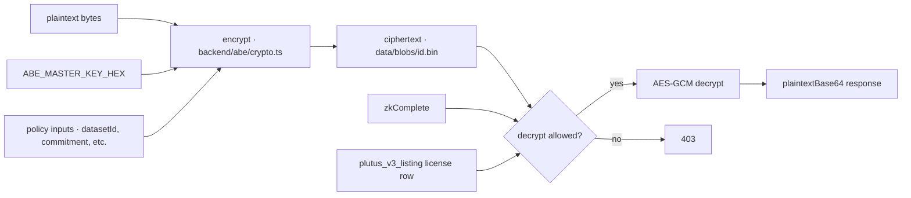

## 7. Marketplace integration

### 7.1 Public REST surface

Base URL default: `http://127.0.0.1:8788`

| Method | Path | Purpose |
|--------|------|---------|
| `GET` | `/health` | liveness + network info |
| `GET` | `/api/datasets` | list datasets (`zkComplete` included) |
| `GET` | `/api/datasets/:id` | dataset detail |
| `POST` | `/api/creator/register` | ingest + commitment + encrypt |
| `POST` | `/api/creator/stamp` | Cardano metadata stamp; returns `l1AnchorDigestHex` |
| `POST` | `/api/creator/midnight/attest` | records Midnight tx hashes + contract address |
| `POST` | `/api/creator/list-license` | locks listing UTxO at Plutus validator |
| `POST` | `/api/developer/license` | purchases listing; records license row |
| `POST` | `/api/developer/decrypt` | returns plaintextBase64 when authorized |

### 7.1.1 Happy path under strict ZK policy

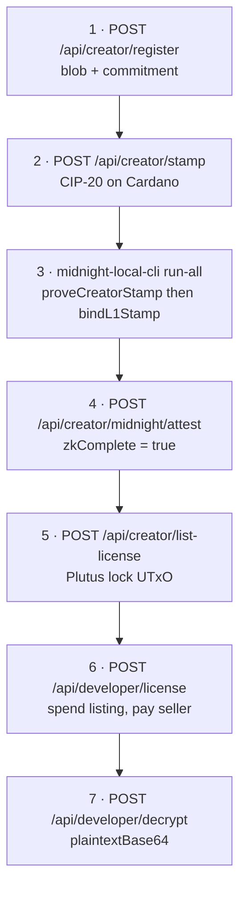

### 7.2 Primary end-to-end workflows

Repo scripts encode the expected workflows and are the authoritative integration spec:

- **Cardano Preprod + Midnight local (undeployed):** `scripts/e2e-cardano-preprod-midnight-local-pretty.sh`
- **Cardano Preprod + Midnight Preview:** `scripts/e2e-cardano-preprod-midnight-preview-pretty.sh`
- **Backend-only quick demo:** `scripts/demo-backend-flow.sh`

The demo/recording pipeline is separate and meant for presentations (asciinema, then mp4).

## 8. Integrations & configuration

### 8.1 Cardano integration

- **Primary:** Blockfrost Preprod
- **Local:** Lucid Evolution emulator (`CARDANO_BACKEND=emulator`)

Key envs (see `.env.example`):

- `BLOCKFROST_PROJECT_ID` (Preprod)
- wallet mnemonics for seller/creator/buyer

### 8.2 Midnight integration

Targets are selected via `MIDNIGHT_DEPLOY_NETWORK`:

- `undeployed` (local Brick Towers docker stack)
- `preview` (public)
- `preprod` (public)

Critical: Cardano and Midnight networks are independent assets (ADA vs tNIGHT/DUST).

### 8.3 Proof server, indexer, node RPC

- Local: proof server typically `http://127.0.0.1:6300`, indexer `http://127.0.0.1:8088/...`
- Hosted: defaults match Midnight docs; override via environment variables in `midnight-local-cli`

## 9. Sandbox run results

This section captures a complete sandbox run on **Cardano Preprod** and **Midnight Preview** and explains what each artifact demonstrates in terms of protocol correctness and marketplace gating.

### 9.1 Run summary

- Network pairing:
  - Cardano: **Preprod**
  - Midnight: **Preview** (`MIDNIGHT_DEPLOY_NETWORK=preview`)
- Dataset:
  - `datasetId`: `daca4e33-0744-44b4-84e6-8416ddebec0c`
  - `demoFilename`: `e2e-preview.txt`
  - `contentCommitmentHex`: `e0b05a1fb580b9efe0a3d61e63bf50143d66cb5da88d4f3e65686ab27f784fc3`

### 9.2 Cardano results

- Stamp tx (CIP-20, label `674`):
  - `stampTxHash`: `70245e6549249362781c0b6647a491eaa7b044397fa0672670da65a319701400`
  - `l1AnchorDigestHex`: `d4c7f6ab2d7a169f0fab7f5c95c69afbac42f582208ae5798e88c53606171671`
  - What this proves:
    - The dataset commitment was anchored on a public ledger transaction.
    - The `l1AnchorDigestHex` value exists as the binding input used by Midnight `bindL1Stamp`.

- License listing lock tx (Plutus V3 listing UTxO created):
  - `licenseListingLockTxHash`: `d6997651e432c00a9c2406d940e1f9c1efa2cd1ea8b8c13bdfc2acfae9557279`
  - What this proves:
    - The on-chain listing path is working: a script output with the listing datum was created.

- License purchase tx (listing UTxO spent with purchase semantics):
  - `licensePurchaseTxHash`: `ed712aedf2a38b56b6d8e339302f233b06f7274963cd08512472af859eb5cf68`
  - What this proves:
    - The validator condition in `nuauth_license_listing` was satisfied: the purchase transaction paid the seller at least the datum `price` in lovelace.
    - The backend can record a `kind: plutus_v3_listing` license row used by the decrypt gate.

### 9.3 Midnight results

- DUST registration:
  - `dustRegistrationTxId`: `00d8dacc3ba8968e44433e53cdbd480031170d1a582cc55169e6bcb71bb0256f52`
  - What this proves:
    - The wallet had sufficient dust setup to balance fees on the Preview network.

- Contract deploy:
  - `contractAddress`: `8579a214e9cfd1ccd50308db93bc865706030210832dc46dac3a6c23d34d5632`
  - `deployTxHash`: `15f33b7f3a9df52db99057a5839a987c5e2c83908c83924070c7a552c35f0a82`
  - `deployBlockHeight`: `119528`
  - What this proves:
    - The Compact contract artifacts were deployable on Preview and the ledger state was initialized with the commitment.

- ZK circuit execution:
  - `proveCreatorStampTxHash`: `e0f0cfad09fe625c95ecc3ed2dbd7ee94ec41df182fd06dc653d3f5d5f4f78bc` (block `119533`)
  - `bindL1StampTxHash`: `941c4c16990588190f78888e8d8f91338e6af8e07a61befbf7e8427ac41b17b7` (block `119537`)
  - What this proves:
    - `proveCreatorStamp` succeeded: the wallet was able to satisfy the creator authority proof gate for this contract instance.
    - `bindL1Stamp` succeeded: the contract instance accepted the Cardano-derived anchor digest and recorded it on Midnight.

### 9.4 Marketplace gating result

This run demonstrates the intended enforcement order under the default strict policy:

- After Cardano stamp alone, the dataset is not considered ZK-complete.
- After Midnight deploy plus both circuits and API attestation, the dataset becomes `zkComplete=true`.
- Only once `zkComplete=true` is satisfied does the marketplace flow proceed to:
  - create a listing UTxO,
  - purchase it,
  - and allow decrypt using the recorded `plutus_v3_listing` license row.

## 9. Evidence & reproducibility

Evidence for a successful public run is captured as:

- **Cardano tx hashes** (stamp, listing lock, purchase)
- **Midnight tx hashes** (deploy, proveCreatorStamp, bindL1Stamp)
- A **registry snapshot** (dataset state + license + midnight attestation)

The repo includes colorized E2E scripts that print and persist machine-readable summaries under `/tmp/` for review.

## 10. Security & operational notes

- Never commit `.env` or any mnemonic / API key
- Treat any mnemonic displayed in logs as compromised; rotate test wallets if exposed
- Encrypt-at-rest is only as strong as `ABE_MASTER_KEY_HEX` handling; for production migrate secrets to a real KMS/HSM

## 11. Known limitations

- ABE is a prototype, not CP-ABE; it is a gate and crypto wrapper suitable for milestone validation and future swap-out
- Registry is JSON-on-disk; production should use a DB and/or a durable event index
- Midnight operational reliability depends on network endpoints; local undeployed stack is recommended for deterministic dev

## 12. Appendix: quick full stack runbook

1) Start API (`deno task serve` or `deno task serve:emulator`)  
2) Register + stamp via API  
3) Run Midnight `npm run midnight:run-all` with `NUAUTH_CONTENT_COMMITMENT_HEX` and `NUAUTH_L1_ANCHOR_HEX`  
4) `POST /api/creator/midnight/attest`  
5) `POST /api/creator/list-license`, then `POST /api/developer/license`, then `POST /api/developer/decrypt`

